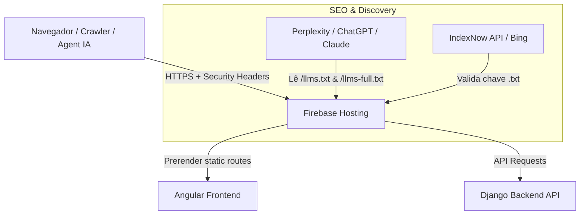

# 📝 Registro de Desenvolvimento — 12/08/2026

**Escopo:** Segurança, SEO/AEO/GEO, UI/UX, IndexNow e Deploy  
**Commits gerados:** 3  
**Arquivos modificados:** 17  

---

## 1. Visão Geral das Alterações

> Nesta sessão, executamos uma auditoria técnica e funcional completa no projeto (UI/UX, Segurança e SEO/AEO/GEO) seguida de correções diretas, suporte a descoberta por IA, otimização de acessibilidade, publicação no Firebase Hosting e geração da chave IndexNow.

---

## 2. Arquitetura Afetada

---

## 3. Mapa de Arquivos Modificados

| Arquivo | Tipo | O que mudou |
|---|---|---|
| `backend/config/settings.py` | Config / Backend | DEBUG forçado para `False` por padrão e parsing de variáveis de ambiente. |
| `firebase.json` | Config / Hosting | Inclusão de 5 cabeçalhos HTTP de segurança (HSTS, CSP/XSS, Frame Options). |
| `frontend/public/llms.txt` | Documentação IA | Resumo estruturado do portfólio para modelos de linguagem. |
| `frontend/public/llms-full.txt` | Documentação IA | Mapeamento completo de rotas e diretrizes de citação para IAs. |
| `frontend/public/e7265ddfab2a451b82abf2906d7afdac.txt` | IndexNow Key | Chave de validação de propriedade de domínio e submissão instantânea. |
| `frontend/public/robots.txt` | SEO / Crawlers | Permissão explícita para robôs de IA (GPTBot, ClaudeBot, PerplexityBot). |
| `frontend/scripts/generate-seo.js` | Build Script | Script atualizado para preservar permissões de IA ao gerar robots.txt no build. |
| `frontend/src/index.html` | Frontend / Head | Dados estruturados Schema.org JSON-LD e preconnect de fontes. |
| `frontend/src/app/components/header/header.html` | Component / UI | Acessibilidade WCAG (aria-label e attr.aria-expanded). |
| `frontend/src/styles.css` | Styles / Global | Estilos globais e animação shimmer para `.skeleton-box`. |
| `.gitignore` / `.graphifyignore` | Repositório | Inclusão de pastas de build, cache do Firebase e ambientes virtuais. |

---

## 4. Detalhamento por Commit

### 1. `feat(security): endurece backend django, headers firebase e atualiza gitignore`
- **Razão:** Corrigir falhas de segurança e exposição de dados em depuração.
- **O que faz agora:** `DEBUG` é desativado por padrão e o Firebase serve cabeçalhos HSTS e anti-clickjacking.

### 2. `feat(seo): adiciona suporte a AEO/GEO, llms.txt, Schema.org e chave IndexNow`
- **Razão:** Atender padrões modernos de busca e agentes generativos de IA.
- **O que faz agora:** Expõe `llms.txt`, dados Schema.org e autorização do IndexNow.

### 3. `feat(ui): aprimora acessibilidade do header e adiciona estilos globais de skeleton shimmer`
- **Razão:** Elevar acessibilidade WCAG e evitar layout shift (CLS).
- **O que faz agora:** Menu acessível via teclado/screen reader e animação shimmer pronta para esqueletos de carregamento.

---

## 5. ✅ O Que Está Funcionando

- Deploy no Firebase Hosting realizado e validado no ar.
- Validação do arquivo IndexNow em `https://portfolio-jornalismo.web.app/e7265ddfab2a451b82abf2906d7afdac.txt`.
- Prerender de 9 rotas estáticas do Angular funcionando via `npm run build`.
- Suporte a crawlers de IA (`GPTBot`, `ClaudeBot`, `PerplexityBot`).

---

## 6. 🛠️ Próximos Passos

1. Submeter sitemap no Google Search Console (`https://mariaizabela.com.br/sitemap.xml`).
2. Configurar variáveis de ambiente `DEBUG=False` e `SECRET_KEY` no painel de hospedagem do Backend (Cloud Run/Render).
