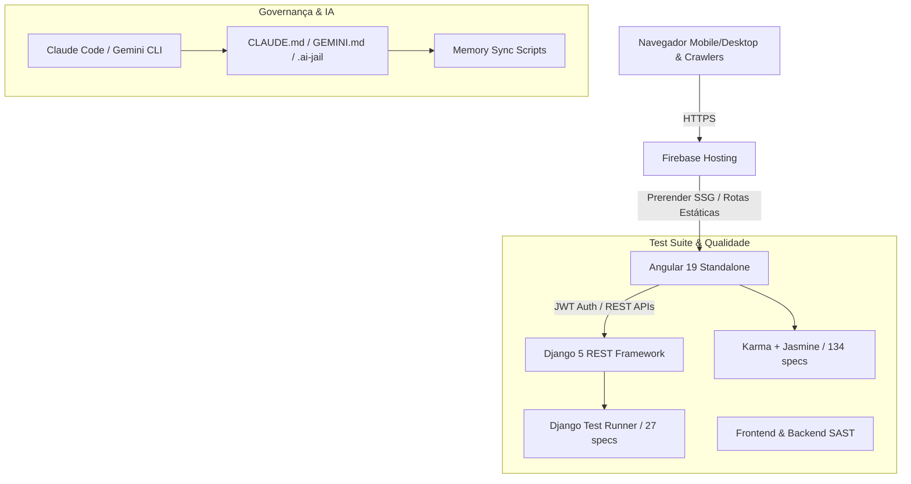

# 📝 Registro de Desenvolvimento — 18/08/2026

**Escopo:** Testes Automatizados Frontend (Angular 19), Harness & Governança de IA, Reforço de Backend e Otimização Mobile UI/UX  
**Commits gerados:** 4  
**Arquivos modificados/criados:** 70+  

---

## 1. Visão Geral das Alterações

> Nesta sessão, reestruturamos todos os 20 guias técnicos de engenharia para Django 5 e Angular 19 Standalone, estabelecemos o harness unificado de IA (`CLAUDE.md`, `GEMINI.md`, `.ai-jail` e scripts de sincronização de memória), corrigimos problemas de layout e overflow horizontal em mobile, implementamos discovery GEO/AEO (`llms.txt`, `llms-full.txt`, JSON-LD), e construímos uma suíte de testes unitários 100% aprovada com 134 specs no Angular 19 (ChromeHeadless).

---

## 2. Arquitetura Afetada

---

## 3. Mapa de Arquivos Modificados e Criados

| Arquivo | Tipo | O que mudou |
|---|---|---|
| `CLAUDE.md` / `GEMINI.md` | Governança | Contratos de desenvolvimento e diretrizes obrigatórias de engenharia. |
| `.ai-jail` | Segurança | Sandbox de restrições para agentes de inteligência artificial. |
| `docs/guides/**` | Documentação | 20 guias de engenharia, testes e padrões reescritos para a stack real. |
| `backend/config/**` | Backend / Auth | Autenticação Firebase com fallback e permissões restritas a admin. |
| `backend/*/tests.py` | Backend / Testes | Cobertura de testes unitários para posts, artigos, projetos e materiais. |
| `frontend/public/llms*.txt` | IA / GEO | Arquivos de descoberta para motores de busca generativos. |
| `frontend/src/app/services/seo.service.ts` | Frontend / SEO | Injeção dinâmica de metadados canônicos e Schema.org NewsArticle. |
| `frontend/src/app/components/**/*.css` | UI / Mobile | Correção de overflow-x, padding responsivo e quebra de palavras. |
| `frontend/src/app/**/*.spec.ts` | Frontend / Testes | 26 arquivos de teste com 134 specs cobrindo pipes, guards, services e components. |
| `frontend/scripts/security_audit.js` | Segurança | Script SAST estático para verificação de padrões inseguros. |

---

## 4. Detalhamento por Commit

### 1. `docs(guides): atualiza guias de engenharia e harness para django rest e angular 19`
**Razão da alteração:** Eliminar guias legados desconexos da stack real do projeto e estabelecer governança de IA.  
**O que faz agora:** Mapeia arquitetura, fluxo de testes, governança e sincronização de memória.  
**Arquivos envolvidos:** `CLAUDE.md`, `GEMINI.md`, `.ai-jail`, `.claude/sync-claude-memory.sh`, `docs/guides/**`.

### 2. `feat(backend): reforca autenticacao firebase, permissoes admin e testes unitarios django`
**Razão da alteração:** Garantir que mutações na API exijam token autenticado de admin e validar endpoints via testes automatizados.  
**O que faz agora:** `IsAdminUserOrReadOnly` protege mutações, autenticação valida tokens Firebase e suíte backend passa integralmente.  
**Arquivos envolvidos:** `backend/config/authentication.py`, `permissions.py`, `views.py`, `tests.py`.

### 3. `feat(seo): implementa headers http, discovery llms.txt e json-ld schema.org`
**Razão da alteração:** Atender às diretrizes de Pesquisa Google e Generative Engine Optimization (GEO/AEO).  
**O que faz agora:** Fornece `llms.txt`, `llms-full.txt`, sitemap com content-type XML estrito e tags Schema.org dinâmicas.  
**Arquivos envolvidos:** `firebase.json`, `public/llms.txt`, `public/llms-full.txt`, `src/index.html`, `seo.service.ts`.

### 4. `fix(ui): otimiza responsividade mobile e elimina overflow horizontal em todas as paginas`
**Razão da alteração:** Prevenir rolagem lateral indesejada em smartphones e melhorar legibilidade de formulários e grids.  
**O que faz agora:** Bloqueia `overflow-x: clip/hidden`, adiciona quebra de linha responsiva e garante ordenação imutável com `[...data].reverse()`.  
**Arquivos envolvidos:** Componentes de UI, `src/styles.css`, `security_audit.js`.

### 5. `test(frontend): implementa suite de testes unitarios com jasmine e karma no angular 19`
**Razão da alteração:** Garantir qualidade contínua e cobertura de testes para pipes, guards, services e components standalone.  
**O que faz agora:** 134 specs executam e passam com 100% de sucesso no ChromeHeadless.  
**Arquivos envolvidos:** 26 arquivos `.spec.ts` em `frontend/src/app/`.

---

## 5. ✅ O Que Está Funcionando

- 134 testes unitários do frontend passando com 0 falhas (`npm test -- --watch=false --browsers=ChromeHeadless`).
- 27 testes do backend passando com 0 falhas (`python manage.py test`).
- Build de produção Angular e pré-renderização de 9 rotas SSG operacionais (`npm run build`).
- Scripts SAST de segurança do frontend e backend aprovados com 0 vulnerabilidades.
- Páginas mobile sem overflow horizontal e formulários responsivos.

---

## 6. ⚠️ Dívida Técnica Identificada

- Avisos de orçamentos de CSS no build para `home.css` (orçamento máximo de 4kB configurado no `angular.json`).
- Dependências CommonJS legadas (`quill-delta` e `@grpc/grpc-js` do Firebase) que emitem alertas não-bloqueantes de otimização de bundle.

---

## 7. Padrões Importantes a Lembrar

- **Imutabilidade em Listas**: Sempre utilizar `[...data].reverse()` ao inverter dados recebidos de observables para evitar mutações de referências compartilhadas.
- **Mocks de PrimeNG**: Componentes com `ConfirmDialog` requerem a injeção de uma instância real de `ConfirmationService` ou observables mockados (`requireConfirmation$`).
- **Angular Signals e rxResource**: Utilizar `TestBed.flushEffects()` e `await fixture.whenStable()` para validar reações síncronas de efeitos e recursos.

---

## 8. Próximos Passos

1. Executar testes de integração end-to-end com Playwright.
2. Configurar pipeline de CI/CD no GitHub Actions executando os testes unitários e build a cada Pull Request.
