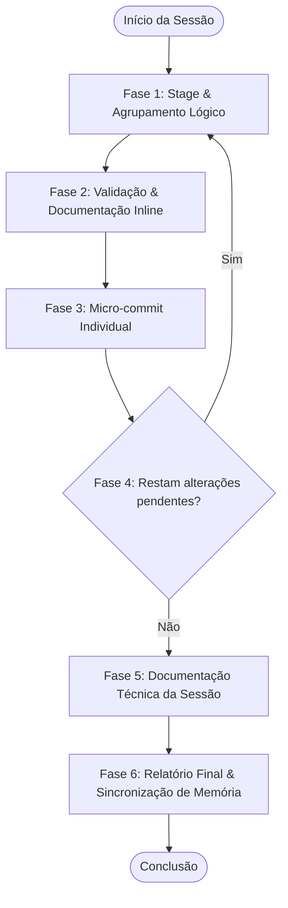

# 📖 Guia Completo do Fluxo de Desenvolvimento, Commit, Documentação e Sincronização de Memórias

Este documento detalha passo a passo a metodologia oficial de engenharia de software, commits semânticos, governança e sincronização de memórias adotada no projeto **jornalismo-Angular**. Ele serve como guia definitivo para desenvolvedores e agentes de Inteligência Artificial (Claude Code e Gemini CLI).

---

## 📐 1. Estrutura Arquitetural do Projeto

O repositório **jornalismo-Angular** organiza-se da seguinte forma:

```
jornalismo-Angular/                     # Repositório Raiz (Governança, Specs, Grafo e Memórias)
├── .agents/                             # Camada compartilhada global de IA (Regras e Workflows)
│   ├── rules/                           # Instruções globais (core-skills.md)
│   └── memory/                          # Base de memórias espelhada do Gemini CLI
├── .claude/                             # Configurações e memórias do Claude Code / OpenClaude
│   ├── memory/                          # Acervo versionado de memórias (.md e MEMORY.md)
│   ├── settings.json                    # Hooks determinísticos de ciclo de vida
│   └── sync-claude-memory.sh            # Script de sincronização bidirecional de memórias
├── .gemini/                             # Configurações e memórias do Gemini CLI
│   ├── memory/                          # Acervo de memórias do Gemini
│   └── settings.json                    # Configuração de hooks e MCPs
├── backend/                             # API REST em Django 5 + Django REST Framework
│   ├── artigos/                         # Reportagens e matérias publicadas em portais externos
│   ├── blog/                            # Artigos e reflexões editoriais profundas
│   ├── materiais/                       # Recursos educativos e e-books
│   ├── projetos/                        # Projetos acadêmicos e iniciativas de comunicação
│   └── config/                          # Configurações globais do Django, URLs e permissões
├── frontend/                            # Aplicação Web Angular 19 (SSG / SSR / PrimeNG)
│   ├── src/app/components/              # Componentes de UI (home, blog, artigos, materiais, projetos)
│   ├── src/app/services/                # Serviços de API, SEO e autenticação
│   └── public/                          # Assets estáticos, robots.txt, sitemap.xml, llms.txt
├── docs/                                # Documentação técnica centralizada
│   ├── guides/                          # Manuais e guias práticos do projeto
│   ├── reports/                         # Relatórios técnicos e auditorias
│   └── commits/                         # Relatórios de sessões de desenvolvimento
├── graphify-out/                        # Grafo de Conhecimento indexado (GraphRAG / Graphify)
├── CLAUDE.md                            # Diretrizes globais do Claude Code
└── GEMINI.md                            # Diretrizes globais do Gemini CLI
```

---

## 🔄 2. O Ciclo Determinístico em 6 Fases (`/commit-e-documentar`)



---

### 🔹 Fase 1: Stage e Agrupamento Lógico por Afinidade

1. **Inspeção de Estado**:
   ```bash
   git status --porcelain
   ```
2. **Agrupamento**: Separe as alterações por contexto lógico e componente.
   - *Exemplo Frontend*: Componente `artigos.html`, `artigos.css` e `artigo.service.ts`.
   - *Exemplo Backend*: Model `Artigo`, serializer e view no app `artigos`.
   - *Exemplo SEO/Docs*: `robots.txt`, `llms.txt` e relatórios de auditoria.
3. **Adição Seletiva**:
   ```bash
   git add frontend/src/app/components/artigos/
   ```

---

### 🔹 Fase 2: Validação e Documentação Inline

Antes de confirmar qualquer commit:

1. **Documentação Inline (JSDoc/Docstrings)**:
   - Toda nova função, componente ou serializer deve possuir comentários explicativos em **pt-BR**.
2. **Checagem Estática de Tipos e Build**:
   - **Frontend (Angular)**:
     ```bash
     cd frontend && npm run build
     ```
   - **Backend (Django)**:
     ```bash
     cd backend && python manage.py test
     ```

---

### 🔹 Fase 3: Micro-commits Isolados (Conventional Commits)

Cada grupo de alterações validado deve ser commitado individualmente seguindo o padrão **Conventional Commits**:

- **Formato**: `<tipo>(<escopo>): <descrição>`
- **Tipos Permitidos**:
  - `feat`: Nova funcionalidade (ex: `feat(blog): adiciona filtro por categoria`).
  - `fix`: Correção de bug (ex: `fix(ui): corrige overflow horizontal no mobile`).
  - `docs`: Documentação (ex: `docs(seo): adiciona relatorio executivo de auditoria`).
  - `style`: Ajustes visuais ou CSS.
  - `refactor`: Refatoração sem alteração de comportamento.
  - `test`: Testes automatizados.
  - `chore`: Tarefas de build, dependências ou configuração do harness.

- **Comando com HEREDOC**:
  ```bash
  git commit -m "$(cat <<'EOF'
  feat(materiais): adiciona visualizacao de e-books em modal

  Implementa componente de visualizacao previa e download de materiais educativos.
  EOF
  )"
  ```

---

### 🔹 Fase 4: Repetição e Limpeza Completa

Repita as **Fases 1, 2 e 3** até que `git status --porcelain` retorne 100% limpo em todos os diretórios.

---

### 🔹 Fase 5: Documentação Técnica da Sessão

Após concluir os micro-commits, gere um relatório consolidado em `docs/commits/YYYY-MM-DD_<escopo-principal>.md`.

#### Estrutura Obrigatória:
1. **Cabeçalho com Metadados**: Data, Escopo, Quantidade de Commits e Arquivos Atingidos.
2. **Visão Geral das Alterações**: Resumo executivo em 2–4 frases.
3. **Diagrama Arquitetural (Mermaid)**: Mapeamento de fluxo entre serviços e componentes afetados.
4. **Mapa de Arquivos Modificados**: Tabela detalhando cada arquivo e o que mudou.
5. **Detalhamento por Commit**: Razão da alteração e arquivos envolvidos.
6. **Status do Projeto**: O Que Está Funcionando vs. Pendências.

```bash
git add docs/commits/YYYY-MM-DD_<escopo>.md
git commit -m "docs(commits): registra sessao de desenvolvimento de YYYY-MM-DD"
```

---

### 🔹 Fase 6: Relatório Final & Sincronização de Memória

Execute a sincronização de memórias do agente:
```bash
./.claude/sync-claude-memory.sh pull
```
